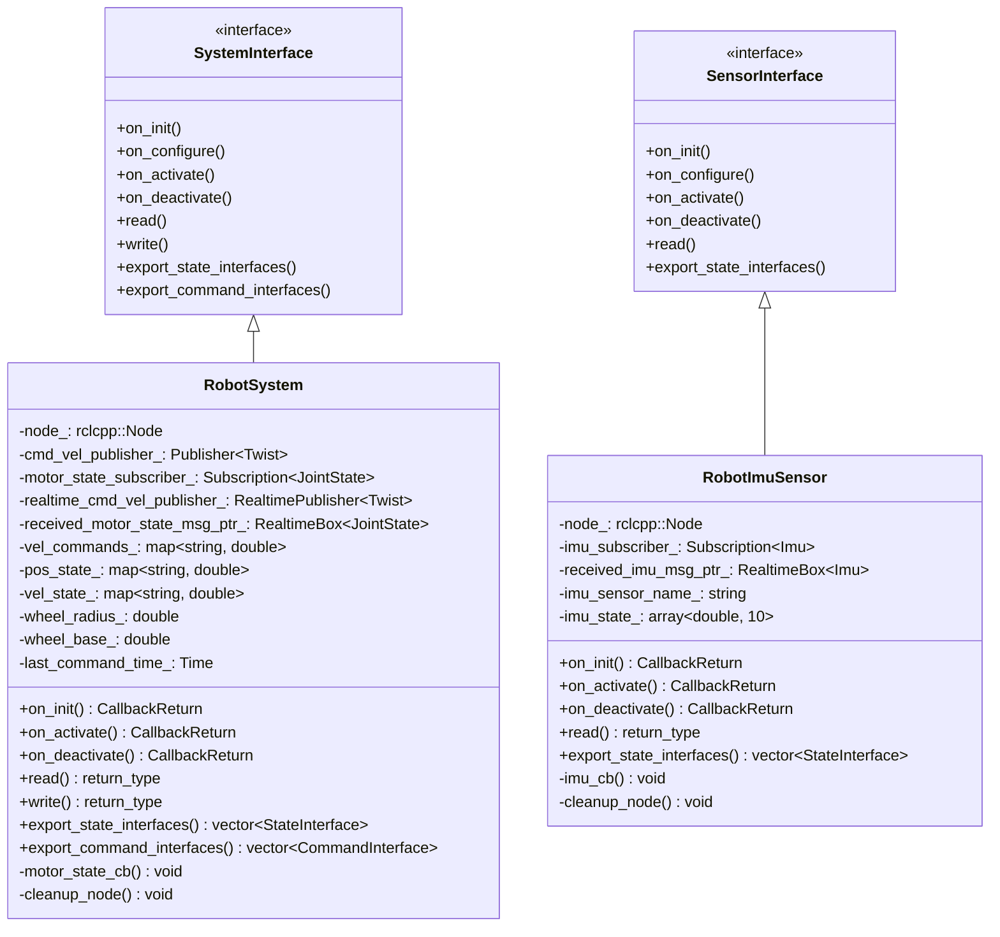
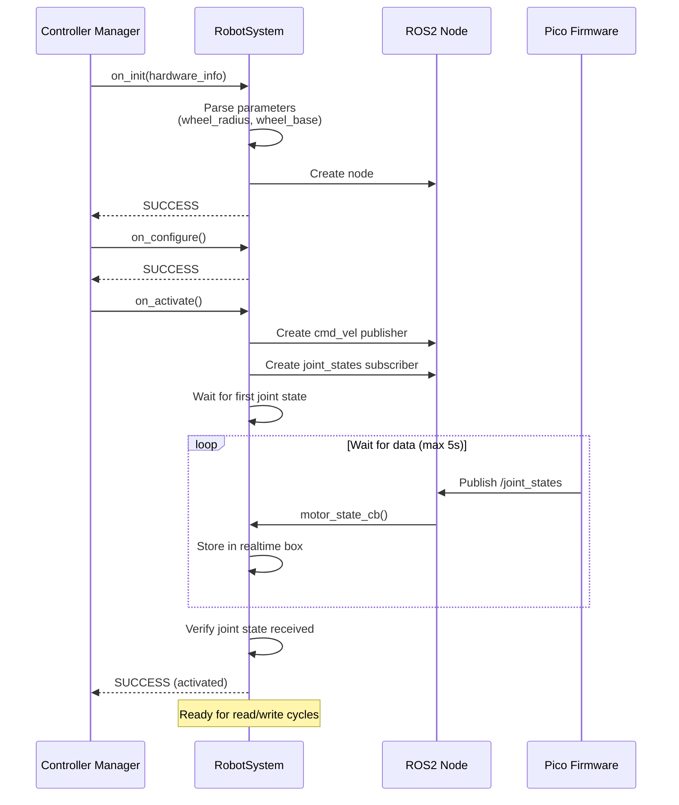
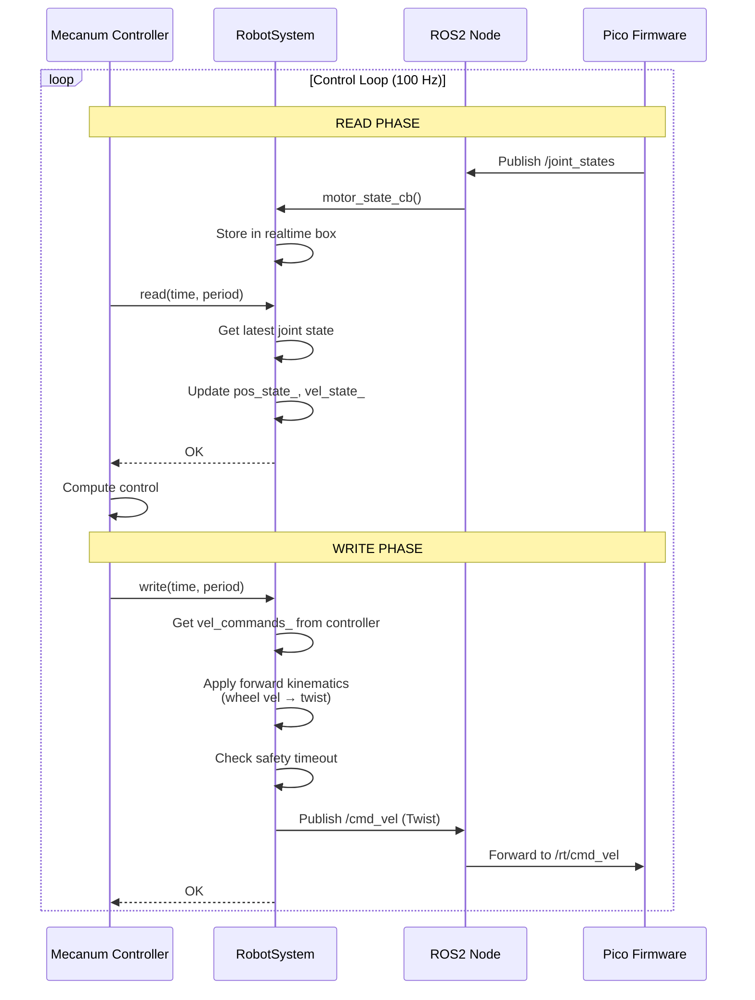
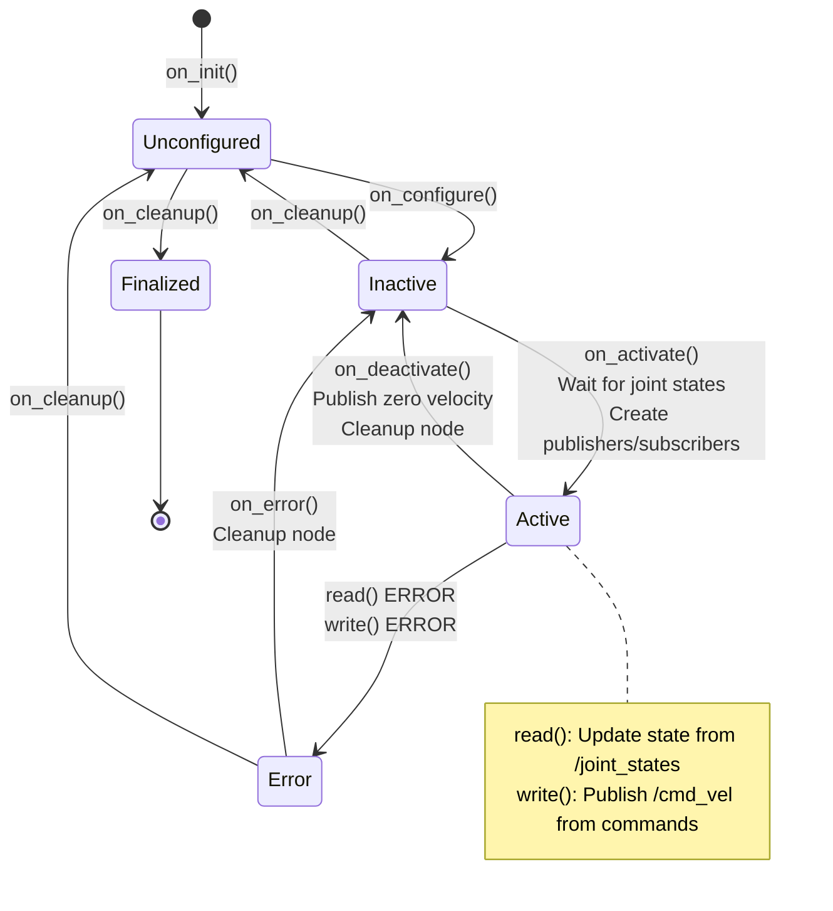

# robot_hardware_interfaces Architecture

## Overview

This package implements the ros2_control hardware interface for the robot_xl platform, bridging ROS2 controllers with the Pico firmware via micro-ROS.

## Component Diagram

```mermaid
graph TB
    subgraph "ROS2 Controllers"
        MC[Mecanum Drive Controller]
        IB[IMU Broadcaster]
        JSB[Joint State Broadcaster]
    end
    
    subgraph "Hardware Interface (ros2_control)"
        RS[RobotSystem<br/>SystemInterface]
        RIS[RobotImuSensor<br/>SensorInterface]
    end
    
    subgraph "ROS2 Topics"
        JS[/joint_states<br/>sensor_msgs/JointState]
        IMU[/imu/data_raw<br/>sensor_msgs/Imu]
        CV[/cmd_vel<br/>geometry_msgs/Twist]
    end
    
    subgraph "micro-ROS Agent"
        MRA[Topic Remapping<br/>/rt/* ↔ /*]
    end
    
    subgraph "Pico Firmware"
        FW[micro-ROS Client<br/>Publishers & Subscribers]
    end
    
    MC -->|velocity commands| RS
    RS -->|state interfaces| MC
    RS -->|state interfaces| JSB
    RIS -->|state interfaces| IB
    
    RS -->|publish| CV
    RS -.->|subscribe| JS
    RIS -.->|subscribe| IMU
    
    CV --> MRA
    JS --> MRA
    IMU --> MRA
    
    MRA <-->|USB Serial| FW
    
    style RS fill:#4CAF50
    style RIS fill:#4CAF50
    style MRA fill:#2196F3
    style FW fill:#FF9800
```

## Class Diagram



## Sequence Diagram: System Activation



## Sequence Diagram: Control Loop



## Data Flow Diagram

```mermaid
flowchart LR
    subgraph "Controller Layer"
        MC[Mecanum Drive<br/>Controller]
    end
    
    subgraph "Hardware Interface Layer"
        direction TB
        CMD[Command Interfaces<br/>4x velocity]
        STATE[State Interfaces<br/>4x position<br/>4x velocity]
        
        subgraph "RobotSystem"
            VEL[vel_commands_<br/>map]
            POS[pos_state_<br/>map]
            VELS[vel_state_<br/>map]
            FK[Forward Kinematics<br/>wheel vel → twist]
        end
    end
    
    subgraph "ROS2 Topics"
        CV[/cmd_vel<br/>Twist]
        JS[/joint_states<br/>JointState]
    end
    
    subgraph "Firmware"
        IK[Inverse Kinematics<br/>twist → wheel vel]
        ENC[Encoders]
    end
    
    MC -->|write| CMD
    CMD --> VEL
    VEL --> FK
    FK --> CV
    CV --> IK
    IK --> Motors
    
    ENC --> JS
    JS --> POS
    JS --> VELS
    POS --> STATE
    VELS --> STATE
    STATE -->|read| MC
```

## State Machine Diagram



## Key Design Decisions

### 1. Twist vs Float32MultiArray

**Decision**: Use `geometry_msgs/Twist` for velocity commands instead of `std_msgs/Float32MultiArray`

**Rationale**:
- Standard ROS2 message type (REP-103)
- Semantic meaning (linear.x/y/z, angular.x/y/z)
- Compatible with Nav2, teleop, and other standard tools
- Firmware handles inverse kinematics (Twist → wheel velocities)
- Hardware interface handles forward kinematics (wheel velocities → Twist)

### 2. No Mock Mode

**Decision**: Hardware interface returns ERROR if no real data received

**Rationale**:
- Ensures system operates with real hardware feedback
- Faster detection of connection issues
- Prevents silent failures
- More reliable operation

### 3. Realtime Safety

**Decision**: Use realtime-safe data structures (RealtimeBox, RealtimePublisher)

**Rationale**:
- Prevents priority inversion in control loop
- Lock-free data exchange between callbacks and control loop
- Maintains deterministic timing

### 4. Safety Timeout

**Decision**: Publish zero velocity if no commands received for 500ms

**Rationale**:
- Prevents runaway robot if controller crashes
- Standard safety practice in mobile robotics
- Configurable timeout period

## Configuration Parameters

| Parameter | Type | Default | Description |
|-----------|------|---------|-------------|
| `connection_timeout_ms` | uint | 5000 | Timeout waiting for first joint state (ms) |
| `connection_check_period_ms` | uint | 100 | Period to check for connection (ms) |
| `wheel_radius` | double | 0.047 | Wheel radius in meters |
| `wheel_base` | double | 0.220 | Wheel base (center to wheel) in meters |
| `velocity_command_joint_order` | string | - | Comma-separated joint names in order |

## Topics

### Published

| Topic | Type | QoS | Rate | Description |
|-------|------|-----|------|-------------|
| `/cmd_vel` | geometry_msgs/Twist | SystemDefaultsQoS | 100 Hz | Velocity commands to firmware |

### Subscribed

| Topic | Type | QoS | Rate | Description |
|-------|------|-----|------|-------------|
| `/joint_states` | sensor_msgs/JointState | SensorDataQoS | 100 Hz | Encoder feedback from firmware |
| `/imu/data_raw` | sensor_msgs/Imu | SensorDataQoS | 50 Hz | IMU data from firmware |

## Performance Characteristics

- **Control Loop Frequency**: 100 Hz
- **Read Latency**: < 1 ms (realtime-safe)
- **Write Latency**: < 1 ms (realtime-safe)
- **Activation Time**: < 5 seconds (waiting for firmware)
- **Safety Timeout**: 500 ms (configurable)

## Error Handling

| Error Condition | Detection | Action | Recovery |
|----------------|-----------|--------|----------|
| No joint states on activation | Timeout (5s) | Return ERROR from on_activate() | Retry activation |
| No joint states during operation | Null pointer check | Return ERROR from read() | Controller manager handles |
| Joint name mismatch | Name lookup failure | Log error, return ERROR | Fix URDF/firmware |
| Publisher not initialized | Null pointer check | Return ERROR from write() | Should not happen |
| Command timeout | Time since last command > 500ms | Publish zero velocity | Automatic on next command |

## Dependencies

- **rclcpp**: ROS2 C++ client library
- **hardware_interface**: ros2_control hardware interface
- **realtime_tools**: Realtime-safe data structures
- **sensor_msgs**: JointState, Imu message types
- **geometry_msgs**: Twist message type
- **pluginlib**: Plugin loading mechanism
